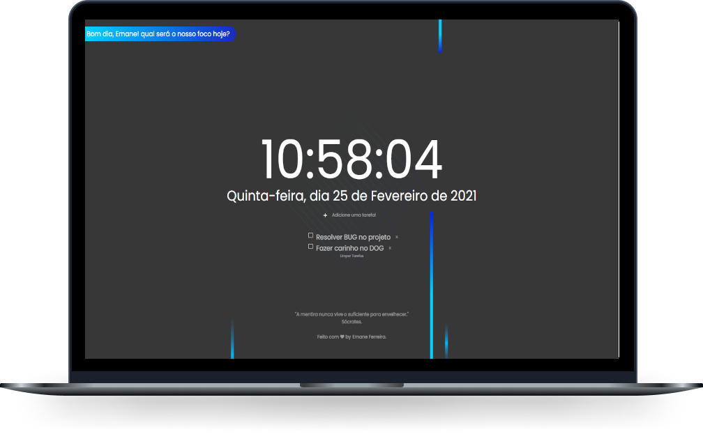

<h1 align="center">
  <strong>Precious Time</strong>
</h1>

  <a href="#-tecnologias">Tecnologias</a>&nbsp;&nbsp;&nbsp;|&nbsp;&nbsp;&nbsp;
  <a href="#-projeto">Projeto</a>&nbsp;&nbsp;&nbsp;

 

  

## 🚀 Tecnologias

O Precious Time foi desenvolvido com as seguintes tecnologias:

- HTML5
- CSS3
- JavaScript

## 💻 Projeto

O Precious Time é um relógio interativo de execução em tempo real feito para quem gosta de organizar suas tarefas diárias em tópicos de execução e bater suas metas todos os dias. 

Clique <a href="https://ernanej.github.io/Precious_Time/index.html" target="_blank">aqui</a> para acessá-lo.

---

Feito com ♥ by Ernane Ferreira 👋🏻 
<small>Projeto desenvolvito com foco pessoal e educacional.<small>

